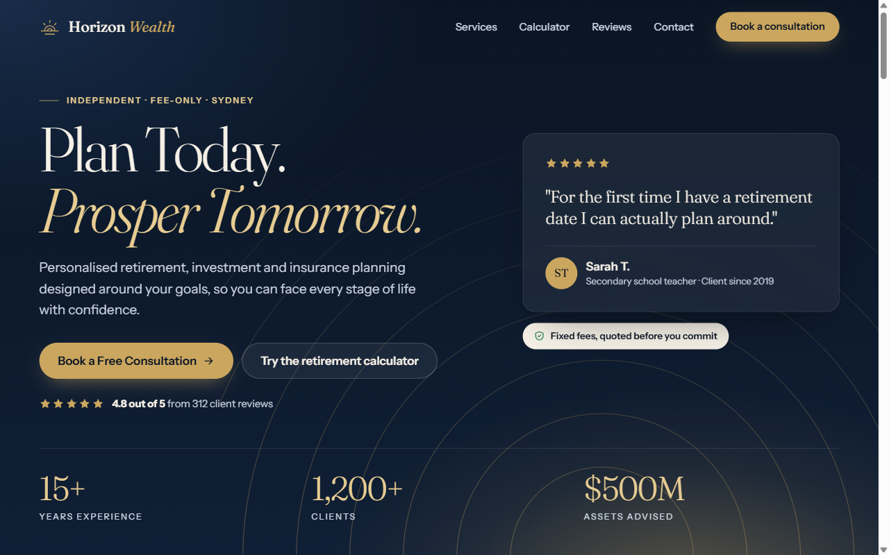

# claude-project

A one-page marketing site for **Horizon Wealth Planning**, a fictional financial planning firm offering retirement, investment and insurance planning. The whole site is a single self-contained `index.html` with no frameworks and no build step.

**Live site (v3):** https://einxenon.github.io/claude-project/v3/

**Earlier versions:** [v2](https://einxenon.github.io/claude-project/v2/) (dark navy design) and [v1](https://einxenon.github.io/claude-project/) (the original)



## What is on the page

This describes v3, a bright, family-themed design in cream, coral, yellow, teal and indigo.

- **Navigation** that is transparent over the hero and solid once you scroll, with a reading-progress bar, a highlight for the section in view, and links to Services, Calculator, Reviews and Contact
- **Hero** with the headline "Plan Today. Prosper Tomorrow.", an inline SVG illustration of a family outside their home, a featured client quote, the overall rating, and three statistics that count up when they scroll into view
- **Trust marquee**, a looping strip of how the firm works (fee-only, no commissions, fees in writing), which pauses on hover
- **Services slider** with five cards. It scrolls by touch, trackpad, mouse drag, arrow buttons or arrow keys, shows a position counter and progress bar, and each card's link preselects that service in the enquiry form
- **Retirement calculator** with five range sliders (age, retirement age, savings, monthly contribution, assumed return). It shows a projected balance, a growth chart and the split between contributions and growth, all computed in the browser
- **Reviews** with a rating summary and star breakdown, a before-and-after case study, and a carousel of six reviews, each tied to the worry the client arrived with. It shows one card on small screens, two from 768px and three from 1024px, with dots, auto-play, a pause button, drag, swipe and arrow-key support
- **Enquiry form** with client-side validation, a character counter and a success panel. There is no backend: a submitted enquiry is not sent or stored anywhere.
- **Footer** with quick links, services, a newsletter sign-up and social links
- **Back-to-top** button

The page is mobile-first with breakpoints at 768px and 1024px. It respects `prefers-reduced-motion`, and stays readable with JavaScript turned off (the calculator, which needs JavaScript, is hidden in that case).

## Security

- The deployed v2 and v3 pages carry a strict Content-Security-Policy: everything is blocked by default, the page's own inline `<style>` and `<script>` are allowed by SHA-256 hash, and the only other origins allowed are Google Fonts. Form posts, `<base>` tags and plugins are blocked, and Trusted Types are required, so `innerHTML`-style DOM injection throws instead of running.
- The page loads no third-party scripts or images. Icons, hero art and avatars are inline SVG and CSS.
- User input is only written to the page as text, is length-limited and stripped of control characters, and is never logged to the console. The enquiry form has a honeypot field for bots and ignores double submits.
- The deploy workflow pins every GitHub Action to a commit SHA, checks out without persisting credentials, and Dependabot proposes updates to those pins.

Limits worth knowing: GitHub Pages cannot send custom HTTP headers, so protections that only work as headers (`frame-ancestors` against clickjacking, HSTS, `X-Content-Type-Options`) are not available here. All form checks are client-side; a real backend would need to repeat them and add rate limiting and CSRF protection.

## Run it locally

Open `index.html` in a browser. On Windows:

```powershell
Start-Process "index.html"
```

There is nothing to install, build, lint or test. The local file has no Content-Security-Policy; that is added at deploy time.

## Project structure

| Path | Purpose |
| --- | --- |
| `index.html` | The whole site (v3): markup, one `<style>` tag and one `<script>` tag |
| `.github/workflows/pages.yml` | Deploys v1, v2 and v3 to GitHub Pages |
| `.github/dependabot.yml` | Keeps the pinned GitHub Actions up to date |
| `docs/screenshot.png` | Screenshot of the live site shown in this README, refreshed by `/publish` |
| `.claude/commands/publish.md` | Claude Code `/publish` command that scans, pushes, deploys and screenshots this repo |
| `.mcp.json` | Registers the Playwright MCP server that `/publish` uses to take the screenshot |
| `CLAUDE.md` | Guidance for Claude Code when working in this repo |

Keeping everything in one file is a hard constraint. The only external resource is Google Fonts (Fraunces and Instrument Sans).

## Deployment

Every push to `main` runs the **Deploy to GitHub Pages** workflow, which can also be started manually from the Actions tab. It publishes three pages:

- `/` is v1 and `/v2/` is v2, each taken from git history at a fixed commit, so they stay exactly as they were.
- `/v3/` is the current `index.html`.

v2 and v3 get the Content-Security-Policy tag added on the way out. The workflow computes the style and script hashes from the file it is deploying.

The README, `CLAUDE.md`, the `docs` folder and the `.claude` folder are not part of the deployed site.

## Placeholder content

The address, phone number, email address and social links are placeholders. The firm, the reviews, the rating figures and the case study are fictional samples, and the page says so beneath the reviews. Before using this for a real business, replace them with genuine reviews that clients have agreed to have published.
